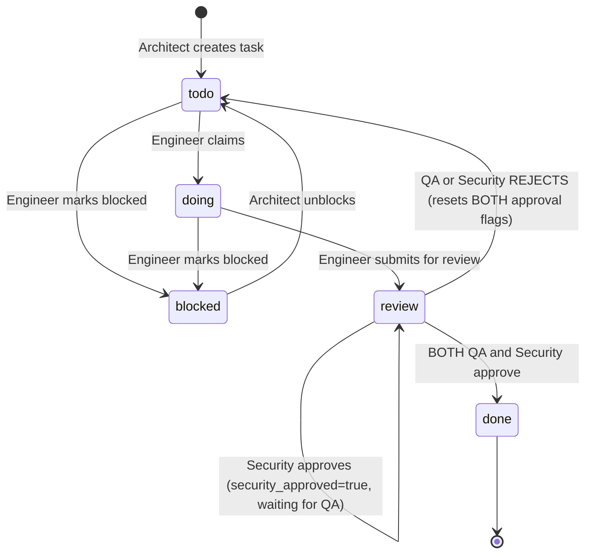

# Castra — The Universal Protocol for Agentic Software Development

> **"The workspace.db is the only truth."** — *The Universal Constitution*

Castra is a standalone Go binary that serves as the coordination protocol for autonomous digital work. It eliminates the complexity of cloud platforms, API servers, and dependency chains by operating directly on a local SQLite database (`workspace.db`). Any AI agent — from any platform — downloads the binary, runs `castra init`, and begins coordinating through a shared, role-enforced, transactional workflow.

**The result:** A single portable file (`workspace.db`) that can be handed to a swarm of disparate AI agents who coordinate perfectly without prior conversation.

---

## The Four Tenets

| Tenet | Principle |
|---|---|
| **Immutable State** | `workspace.db` is the only reality. Chat is a disposable scratchpad for generating a single DB transaction. |
| **Role Purity** | An agent's `SKILL.md` is its sacred duty. Stepping outside your role is the cardinal sin. |
| **Transactional Work** | Work is a series of state changes in the DB, not conversations. Query → claim → execute → update. |
| **Verified Trust** | No agent can approve its own work. Dual-approval gate: both QA and Security must sign off before done. |

---

## Architecture

```
castra (standalone binary)
├── main.go                                    # CLI entrypoint, command dispatch
├── internal/
│   ├── commands/                              # Command handlers (flag parsing, dispatch)
│   │   ├── init.go                            # castra init --antigravity
│   │   ├── project.go                         # castra project add|list|delete
│   │   ├── sprint.go                          # castra sprint add|list
│   │   ├── milestone.go                       # castra milestone add|list|update
│   │   ├── task.go                            # castra task add|list|update|delete
│   │   ├── note.go                            # castra note add|list
│   │   ├── log.go                             # castra log add|list
│   │   └── helpers.go                         # FilterArgs, GetDB, GetSubcommandIndex
│   ├── cli/                                   # Business logic layer (RBAC, dual-approval)
│   │   ├── projects.go                        # Project CRUD
│   │   ├── sprints.go                         # Sprint CRUD
│   │   ├── milestones.go                      # Milestone CRUD
│   │   ├── tasks.go                           # Task CRUD, role validation, approval locks
│   │   ├── notes.go                           # Notes with task-level scoping, role filtering
│   │   ├── audit.go                           # Audit log read/write, auto-logging
│   │   └── tasks_test.go                      # Tests: role filtering, approvals, rejections
│   ├── db/
│   │   ├── schema.go                          # DB connection (delegates to migrations)
│   │   ├── migrate.go                         # Versioned migration engine
│   │   └── migrate_test.go                    # Migration tests (fresh, upgrade, idempotency)
│   └── generator/
│       └── antigravity/                       # Platform-specific template generator
│           ├── antigravity.go                 # InitWorkspace() — walks embedded templates
│           └── templates/                     # Embedded via go:embed
│               ├── rules.md                   # The Universal Constitution
│               ├── architect/                 # SKILL.md, examples, workflows, scripts
│               ├── senior-engineer/
│               ├── junior-engineer/
│               ├── qa-functional/
│               ├── security-ops/
│               └── doc-writer/
└── workspace.db                               # The single source of truth
```

---

## Database Schema

Five tables, managed by a versioned migration system:

```sql
-- Projects: The top-level container
projects (id, name, description, status, notes, created_at, updated_at, deleted_at)

-- Milestones: Major feature groupings or epic roadmaps within a project
milestones (id, project_id, name, status, created_at, updated_at, deleted_at)

-- Sprints: Execution iterations (batches/sessions) within a project
sprints (id, project_id, name, start_date, end_date, status, created_at, deleted_at)

-- Tasks: The granular units of work
tasks (id, project_id, milestone_id, sprint_id, title, description, status, priority, context_ref,
       qa_approved, security_approved, created_at, updated_at, deleted_at)

-- Project Notes: Role-tagged context, optionally scoped to a task
project_notes (id, project_id, task_id, content, tags, created_at, deleted_at)

-- Audit Log: Immutable history of all state changes
audit_log (id, entity_type, entity_id, action, role, payload, timestamp)

-- Schema Version: Migration tracking (single row)
schema_version (version)
```

### Migration System

Schema evolution is handled by a versioned migration runner in `migrate.go`. The `schema_version` table tracks the current version. Migrations are an ordered Go slice — each applied in a transaction with automatic version bumps.

**Pre-migration databases** (created before the migration system) are auto-detected: if tables exist but no `schema_version`, the DB is marked as v1 and only ALTER TABLE migrations (v2+) are applied.

---

## The Six Roles

| Role | Persona Name | Description |
| :--- | :--- | :--- |
| **`architect`** | **The Lawgiver** | Systems architect and project manager. The only role that can create projects, milestones, sprints, and tasks. |
| **`senior-engineer`** | **The Pragmatist** | Core implementer. Picks up tasks, writes code, moves tasks to `review` or `blocked`. |
| **Duty** | Translate vision into projects, sprints, and tasks. |
| **Prohibition** | Does not write code. Does not execute. Only commands. |
| **Status Control** | Any → Any |
| **Context Lens** | Unfiltered — sees everything. |

### 2. Senior Engineer — *The Core Builder* (`--role senior-engineer`)
| Aspect | Detail |
|---|---|
| **Power** | Takes the hardest blueprints and turns them into load-bearing code. |
| **Duty** | Execute complex tasks with clean, robust, scalable code. |
| **Prohibition** | Cannot mark tasks `done`. Cannot approve own work. |
| **Status Control** | `todo` → `doing` → `review` |
| **Context Lens** | Filtered to `todo`, `doing`, `blocked`, `pending`. |

### 3. Junior Engineer — *The Maintainer* (`--role junior-engineer`)
| Aspect | Detail |
|---|---|
| **Power** | Focus. Single, clear instructions executed flawlessly. |
| **Duty** | Bug fixes, refactors, dependency updates, small tasks. |
| **Prohibition** | Cannot mark tasks `done`. Cannot architect new systems. |
| **Status Control** | `todo` → `doing` → `review` (can also `blocked`) |
| **Context Lens** | Filtered to `todo`, `doing`, `blocked`, `pending`. |

### 4. Functional QA — *The Guardian* (`--role qa-functional`)
| Aspect | Detail |
|---|---|
| **Power** | Holds the first of two keys to `done`. |
| **Duty** | Test observable behavior against requirements. User's advocate. |
| **Prohibition** | Does not read source code. Only tests behavior. |
| **Status Control** | `review` → `done` (approve) or `review` → `todo` (reject) |
| **Context Lens** | Filtered to `review` status only. |

### 5. Security Ops — *The Sentinel* (`--role security-ops`)
| Aspect | Detail |
|---|---|
| **Power** | Holds the second of two keys to `done`. Veto is absolute. |
| **Duty** | Audit all code for vulnerabilities. Final word on safety. |
| **Prohibition** | Does not care if features work. Only if they're safe. |
| **Status Control** | `review` → `done` (approve) or `review` → `todo` (reject) |
| **Context Lens** | Filtered to `review` status only. |

### 6. Doc Writer — *The Chronicler* (`--role doc-writer`)
| Aspect | Detail |
|---|---|
| **Power** | Turns chaos into library. Creates maps for future architects. |
| **Duty** | Document completed features, synthesize project-level docs. |
| **Prohibition** | Cannot create, test, approve, or change task status. |
| **Status Control** | Read-only. |
| **Context Lens** | Unfiltered — sees all tasks and notes. |

---

## Task Lifecycle



### The Dual-Approval Lock

A task can only transition from `review` to `done` when **both** `qa_approved` and `security_approved` are `true`. When either gatekeeper approves, their flag is set but the task remains in `review`. Only when both flags are true does the status change to `done`.

**On rejection:** When QA or Security rejects a task (moving it to `todo`), **both** approval flags are reset to `false`. This forces a complete re-review cycle — no stale approvals survive a rejection.

---

## CLI Reference

All commands require `--role <role>` (except `init`).

### `castra init`
```bash
castra init --antigravity     # Initialize workspace for Antigravity platform
```
Creates `workspace.db` and generates `.agent/` directory with rules, skills, and workflows.

### `castra project`
```bash
castra project add --role architect --name "..." --desc "..."    # Create project
castra project list --role <role>                                 # List projects
castra project list --role <role> --archived                      # Include archived
castra project delete --role architect <id>                       # Soft delete
```
**Permissions:** Only `architect` can add/delete. All roles can list.

### `castra sprint`
Manages execution iterations (dates are optional strings, useful for either calendar weeks or AI "sessions").
```bash
castra sprint add --role architect --project <id> --name "..." [--start "..."] [--end "..."]
castra sprint list --role <role> --project <id>
```
**Permissions:** Only `architect` can add. All roles can list.

### `castra milestone`
Manages major feature roadmaps.
```bash
castra milestone add --role architect --project <id> --name "..."
castra milestone list --role <role> --project <id>
castra milestone update --role architect --status <open|completed> <id>
```

### `castra task`
Manages granular work items.
```bash
castra task add --role architect --project <id> --milestone <id> --sprint <id> --title "..." --desc "..." --prio <low|medium|high>
castra task list --role <role> --project <id> [--milestone <id>] [--sprint <id>] [--backlog]
castra task update --role <role> --status <status> <id>
castra task delete --role architect <id>
```
**Permissions:** Only `architect` can add/delete. Status transitions are role-enforced (see Task Lifecycle).

### `castra note`
```bash
castra note add --role <role> --project <id> [--task <id>] --content "..." --tags "tag1,tag2"
castra note list --role <role> --project <id> [--task <id>]
```
Notes are scoped to a project, optionally to a specific task. The `--task` flag enables the rejection feedback loop — QA/Security attach rejection reasons directly to the task they're rejecting.

**Filtering:** Junior engineers only see notes tagged with their role. Architect and doc-writer see all notes.

### `castra log`
```bash
castra log add --role <role> --msg "..." [--type <project|sprint|task>] [--entity <id>]
castra log list --role <role> [--type <entity_type>] [--entity <id>]
```
Audit trail. Task status changes, approvals, and rejections are also **auto-logged** by the system.

---

## Workflows

Workflows are step-by-step protocols that define how each role operates. They are generated into `.agent/workflows/` on `castra init` and serve as executable instructions for AI agents.

### Architect (3 workflows)

| Workflow | Trigger | Purpose |
|---|---|---|
| [plan_project](file:///Users/amansingh/dev/castra/internal/generator/antigravity/templates/architect/workflows/plan_project.md) | New project directive | Create project container + architectural vision note |
| [plan_feature](file:///Users/amansingh/dev/castra/internal/generator/antigravity/templates/architect/workflows/plan_feature.md) | Project vision exists | Decompose vision into Feature Sprints + Milestone Tasks |
| [plan_sprint](file:///Users/amansingh/dev/castra/internal/generator/antigravity/templates/architect/workflows/plan_sprint.md) | Milestone selected | Create Active Sprint + break milestone into granular tasks |

### Senior Engineer (2 workflows)

| Workflow | Trigger | Purpose |
|---|---|---|
| [build_cycle](file:///Users/amansingh/dev/castra/internal/generator/antigravity/templates/senior-engineer/workflows/build_cycle.md) | Start of workday | Survey → claim → execute → submit for review → repeat |
| [handle_rejection](file:///Users/amansingh/dev/castra/internal/generator/antigravity/templates/senior-engineer/workflows/handle_rejection.md) | Task reappears in todo | Read rejection notes → fix root cause → resubmit |

### Junior Engineer (2 workflows)

| Workflow | Trigger | Purpose |
|---|---|---|
| [build_cycle](file:///Users/amansingh/dev/castra/internal/generator/antigravity/templates/junior-engineer/workflows/build_cycle.md) | Start of workday | Survey → claim → execute (with blocker escalation) → submit |
| [handle_rejection](file:///Users/amansingh/dev/castra/internal/generator/antigravity/templates/junior-engineer/workflows/handle_rejection.md) | Task reappears in todo | Read rejection notes → fix (or escalate if out of scope) → resubmit |

### Functional QA (2 workflows)

| Workflow | Trigger | Purpose |
|---|---|---|
| [review_cycle](file:///Users/amansingh/dev/castra/internal/generator/antigravity/templates/qa-functional/workflows/review_cycle.md) | Tasks in review | Survey → read spec → test behavior → approve or reject |
| [write_rejection](file:///Users/amansingh/dev/castra/internal/generator/antigravity/templates/qa-functional/workflows/write_rejection.md) | Task fails testing | Write structured rejection note (expected/actual/steps/severity) → reject |

### Security Ops (2 workflows)

| Workflow | Trigger | Purpose |
|---|---|---|
| [audit_cycle](file:///Users/amansingh/dev/castra/internal/generator/antigravity/templates/security-ops/workflows/audit_cycle.md) | Tasks in review | Survey → read code → audit (injection, auth, data, deps, crypto) → approve or reject |
| [write_finding](file:///Users/amansingh/dev/castra/internal/generator/antigravity/templates/security-ops/workflows/write_finding.md) | Vulnerability found | Write structured finding (class/severity/location/remediation) → reject → log |

### Doc Writer (2 workflows)

| Workflow | Trigger | Purpose |
|---|---|---|
| [document_task](file:///Users/amansingh/dev/castra/internal/generator/antigravity/templates/doc-writer/workflows/document_task.md) | Task marked done | Gather context → produce feature documentation → log doc link |
| [synthesize_project](file:///Users/amansingh/dev/castra/internal/generator/antigravity/templates/doc-writer/workflows/synthesize_project.md) | Direct command | Read full project state → synthesize README / release notes / overview |

---

## Skill Package Structure

On `castra init --antigravity`, each role gets a complete skill package generated into `.agent/skills/<role>/`:

```
.agent/
├── rules/
│   └── rules.md                    # The Universal Constitution (5 laws)
├── skills/
│   └── <role>/
│       ├── SKILL.md                # Identity, doctrine, command vocabulary
│       ├── examples.md             # Role-specific CLI examples
│       ├── error_handling.md       # Error recovery protocols
│       └── scripts/
│           └── main.go             # Wrapper binary (auto-injects --role flag)
└── workflows/
    └── <workflow>.md               # Step-by-step operational protocols
```

### The Wrapper Scripts

Each role's `scripts/main.go` is a Go program that wraps the `castra` CLI, automatically injecting the correct `--role` flag. This means an agent operating as the architect can simply run:

```bash
cd .agent/skills/architect/scripts
go run main.go project add --name "..." --desc "..."
# equivalent to: castra project add --role architect --name "..." --desc "..."
```

---

## The Universal Constitution (rules.md)

Five immutable laws that govern all agents:

1. **State Management (The Ledger)** — Do not rely on chat history. Query `workspace.db` before every action. Update status after every action.
2. **Role Boundaries (The Lane)** — Obey your `SKILL.md`. Reject any request outside your scope.
3. **Mandatory Auditing (The Echo)** — No action is complete until it is logged.
4. **Communication Protocol (The Void)** — Zero conversational filler. Output only technical artifacts.
5. **Execution Protocol (The Interface)** — No Markdown plans in chat. All planning routes through `castra` CLI.

---

## Platform Extensibility

The `init` command uses a generator abstraction layer. Currently only `--antigravity` exists, but the architecture supports adding new platform generators (e.g., `--copilot`, `--gemini-cli`) as separate packages under `internal/generator/`.

Each generator implements its own `InitWorkspace()` function and embeds its own templates. The dispatch happens in `init.go`:

```go
case *useAntigravity:
    antigravitygen.InitWorkspace(cwd)
// Future:
// case *useCopilot:
//     copilotgen.InitWorkspace(cwd)
```

---

## Quick Start

```bash
# 1. Build
go build -o castra .

# 2. Initialize workspace
./castra init --antigravity

# 3. Create a project (as Architect)
./castra project add --role architect --name "Project Alpha" --desc "Next-gen AI platform"

# 4. Create an iteration/sprint
./castra sprint add --role architect --project 1 --name "Iteration 1"

# 5. Add a task to the milestone and sprint
./castra task add --role architect --project 1 --milestone 1 --sprint 1 --title "Setup DB" --desc "SQLite schema"

# 6. Engineer works
./castra task update --role senior-engineer --status doing 1
./castra task update --role senior-engineer --status review 1

# 7. QA approves
./castra task update --role qa-functional --status done 1
# → "Task approved by qa-functional. Waiting for other approval to mark DONE."

# 8. Security approves
./castra task update --role security-ops --status done 1
# → Task transitions to done. Both gates passed.
```
