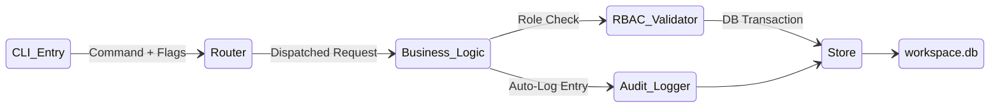

# Castra: Technical Specification (v2.0)

## Architecture Overview
Castra is a standalone Go binary operating as a stateless coordination layer over a persistent SQLite `workspace.db`.



## Core Components

### 1. The HATEOAS Affordance Engine
Dynamically determines available commands based on:
- **Active Role**: (Architect vs Engineer vs QA vs Security)
- **Current Task Status**: (todo, doing, review, blocked, done)
- **Approvals**: (qa_approved, security_approved)

### 2. The Persona Linter (Gate 3)
Systemic enforcement of `SKILL.md` constraints:
- Validates the active role against the requested command.
- Prevents "out-of-bounds" transitions (e.g., Engineers marking tasks as `done`).

### 3. Hierarchical Milestone System
Allows nesting of milestones to create complex roadmaps:
```sql
CREATE TABLE milestones (
    id INTEGER PRIMARY KEY,
    project_id INTEGER,
    parent_id INTEGER REFERENCES milestones(id),
    name TEXT,
    ...
);
```

## Database Schema (v11)

### `projects`
- Root container for all work.

### `milestones`
- Hierarchical feature groupings (Project -> Parent Milestone -> Child Milestone).

### `tasks`
- Granular units of work.
- Transitions governed by HATEOAS and Dual-Approval locks.

### `audit_log`
- Immutable history of all state changes.
- Contains: `entity_type`, `entity_id`, `action`, `role`, `payload`, `timestamp`.

## SDLC Tier-3 Protocols

### The Dual-Approval Gate
A task moves to `done` ONLY when:
- `qa_approved = 1` (Functional correctness verification).
- `security_approved = 1` (Code audit verification).
- **Atomic Reset**: Any rejection (moving back to `todo`) resets BOTH flags to 0.

### Break-Glass Protocol
- Emergency override for Architects (`--break-glass`).
- Sets `qa_bypassed = 1` or `security_bypassed = 1`.
- Triggers a mandatory **Post-Incident Review** task in the backlog.

## Multi-Vendor Generation
The `init` command uses a registry of generators to deploy vendor-specific Supreme Law entry points:
- `Antigravity`: `.agent/rules/rules.md`
- `Claude`: `CLAUDE.md`
- `Copilot`: `.github/copilot-instructions.md`
- `Gemini`: `GEMINI.md`
